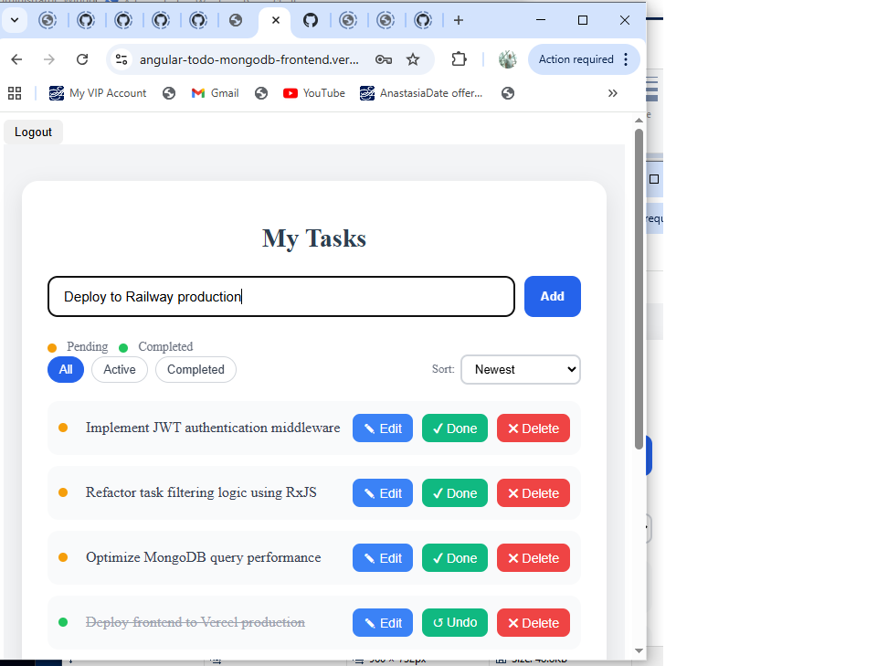
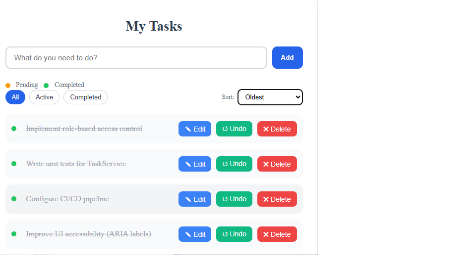
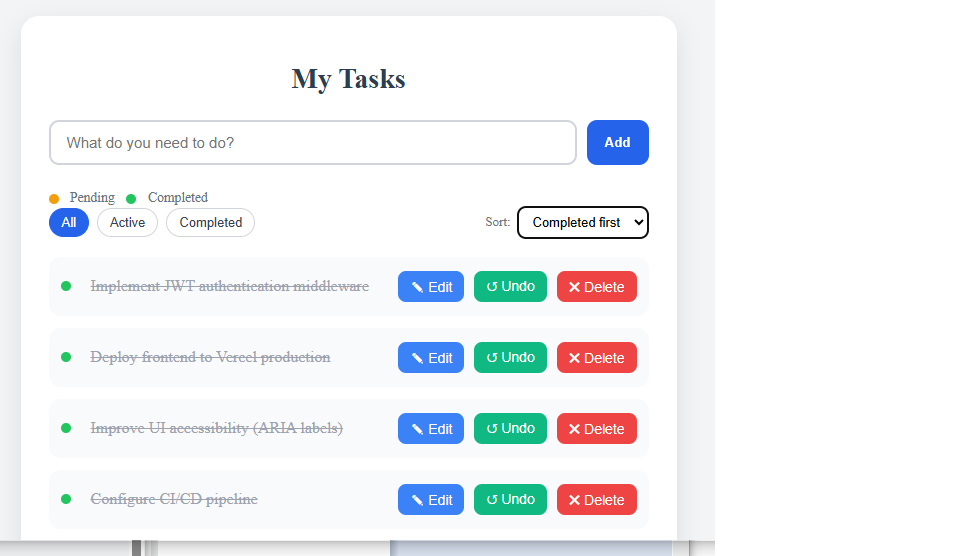
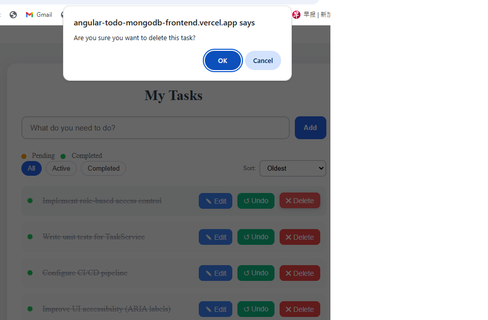
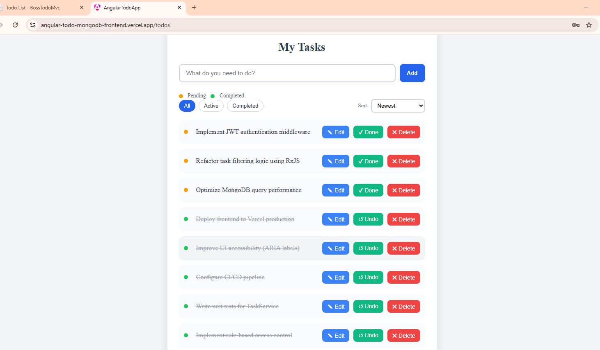
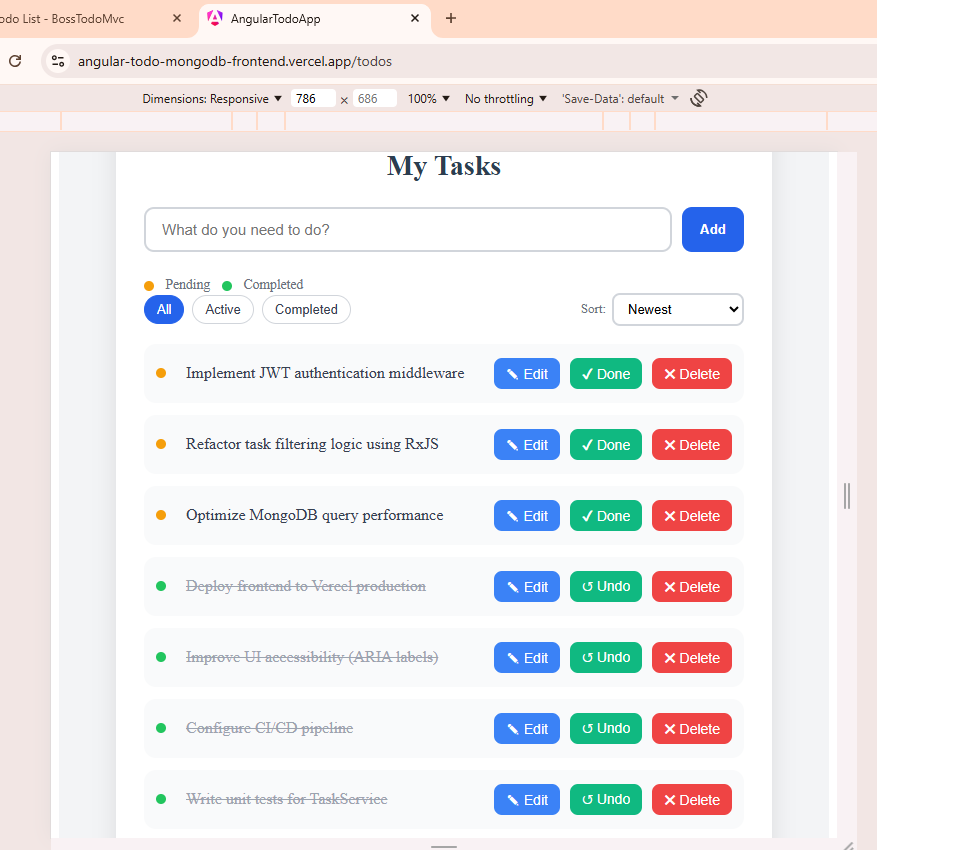
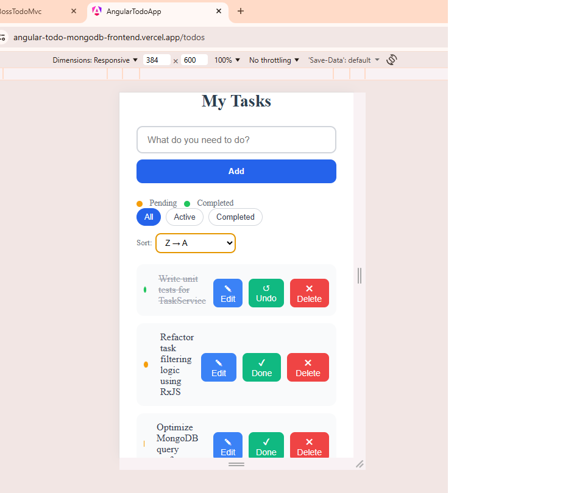
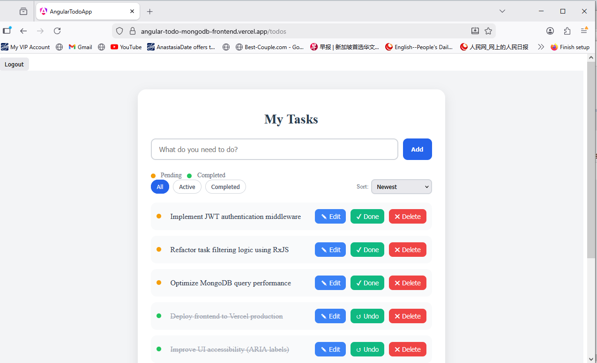

# 🚀 Angular Todo – Distributed Full-Stack Application

- A distributed full-stack application demonstrating secure authentication, 
- scalable API architecture, and cloud-based deployment.

## 🔍 Project Overview

This project is a production-oriented distributed web application built with 

**Angular (SPA frontend)** and **Node.js + Express (REST API backend)**, 
backed by **MongoDB Atlas**.

The system demonstrates real-world engineering practices including:
cla
* JWT-based stateless authentication
* Secure cross-origin communication (CORS configuration)
* Cloud-based distributed deployment
* Clean API architecture design 
* Separation of concerns
* Scalable client-server design
* Responsive UI implementation.

### Frontend and backend are independently deployed, simulating a real cloud-hosted 
### microservice-style architecture.
* Responsive • JWT-Ready • Cloud-Deployed • Dual-Mode Environment
* Live Production URL: https://angular-todo-mongodb-frontend.vercel.app/login
* Backend API URL: https://angular-todo-mongodb-backend-production.up.railway.app/
* A production-oriented full-stack To application built with Angular and Node.js, 
* designed with mobile-first responsive principles and deployed to the cloud with CI/CD automation.
* This project demonstrates frontend engineering discipline, backend API integration, 
* environment-based configuration, and real production deployment practices.

### This application provides a complete Todo management system featuring:
* Task creation, editing, deletion
* Completion / undo functionality
* Sorting & filtering logic
* Responsive UI (mobile → desktop)
* Cloud deployment with 24/7 availability
* Environment-based local + production modes

### The system is architected to simulate a real production web application 
### rather than a simple frontend demo.

## 🌐 Live Demo

* 🔗 **Frontend (Vercel):** https://angular-todo-mongodb-frontend.vercel.app/login
* 🔗 **Backend API (Railway / Cloud Host):** https://angular-todo-mongodb-backend-production.up.railway.app/

## 📂 GitHub Repository
* 🔗 **GitHub Repository (Frontend):** https://github.com/Heng03a/angular-todo-mongodb-frontend
* 🔗 **GitHub Repository (Backend):** https://github.com/Heng03a/angular-todo-mongodb-backend

## 🛠 Tech Stack

### Frontend

* Angular
* TypeScript
* RxJS
* Responsive CSS (Flexbox)

### Backend

* Node.js
* Express.js
* RESTful API design

### Database

* MongoDB Atlas (Cloud-hosted NoSQL database)

### Authentication

* JWT (JSON Web Token)
* Stateless session management

### Deployment

* Vercel (Frontend)
* Railway (Backend)
* Distributed cloud architecture

## ✨ Core/Key Features

* Secure user authentication (JWT-based login/register)
* JWT-based authorization via HTTP headers
* RESTful API with structured routing
* Full CRUD task management
* Real-time UI updates
* Task filtering & sorting logic
* Responsive mobile-first layout
* Cross-origin secured communication
* Modular and clean project folder structure for maintainability


## 📸 Screenshots - ✨ Key Functional Features

**Add Task**  


**Task Completed**  



**Sort Completed Task First**  


**Delete task**  


---


## 🧠 Architecture / Logic Design
- Authentication: JWT (JSON Web Token)
- Deployment: Vercel (Frontend), Railway (Backend)
- Architecture Pattern: Distributed Client-Server Architecture

## 🏗 Architecture Overview

- This application follows a distributed client-server model/architecture :

```
 Angular SPA (Frontend)
        ↓
 Secure HTTP Requests (JWT in Authorization Header)
        ↓
 Node.js / Express REST API (Backend)
        ↓
 MongoDB Atlas (Cloud Database)
```

- High-Level Flow

```
[ Browser ] ↓ [ Angular Frontend ] ↓ [ REST API - Node/Express ] ↓ [ Cloud Database ] 
[ Browser ]
      ↓
[ Angular Frontend (Vercel Cloud) ]
      ↓
[ Node.js/Express REST API Backend (Cloud) ]
      ↓
[ Managed Cloud Database ]
```

### Frontend Architecture (Angular)
* Component-based UI structure
* Service layer for API communication
* Environment configuration (environment.ts)
* Clean separation of presentation and data logic
* Mobile-first CSS layout strategy
* Key folders:
* src/
* ├── app/
* │   ├── components/
* │   ├── services/
* │   └── models/
* ├── environments/

### Backend Architecture (Node.js + Express)
* RESTful API endpoints
* Middleware configuration (CORS, JSON parsing)
* Modular route/controller structure
* Environment-based configuration
* Cloud deployment ready

### 🔄 Dual-Mode Environment Configuration
* This application supports two operational modes:

### 🟢 Development Mode (Fully Local Stack)
* Angular runs via ng serve
* Backend runs via node server.js
* Data stored in local database
* Safe isolated development
* No impact to production data
* Configuration:
*  // environment.ts export const environment = { production: false, apiBaseUrl: 'http://localhost:3000/api' }; 

### 🔵 Production Mode (Cloud Hosted)
* Frontend deployed to Vercel
* Backend deployed to cloud hosting platform
* Database hosted in managed cloud service
* 24/7 public accessibility
• No local runtime required
* Configuration:
* // environment.prod.ts export const environment = { production: true, apiBaseUrl: 'https://your-cloud-backend-url/api' }; 
* Angular automatically switches configuration during production build.

### This dual-mode configuration ensures:
* Safe development workflows
* Production stability
* Proper separation of environments
* Professional DevOps discipline

This is standard industry practice for scalable web applications.

## Architectural - Engineering Principles Applied - Key Engineering Decisions

* Frontend and backend deployed independently
* Stateless backend architecture
* API-first design
* Clear separation between presentation, business logic, and data layers
* Environment-based configuration management

### Separation of Concerns
- UI logic handled entirely in Angular components/services
- API logic encapsulated in Express controllers
- Database interactions isolated via model layer
- Environment variables used for configuration isolation

### CORS Configuration
- Backend explicitly configures allowed origins to support secure cross-domain deployment between Vercel and Railway.
- This mirrors real-world microservice communication patterns.

### 🔐 Security Considerations

* JWT stored and transmitted securely via Authorization headers
* CORS explicitly configured to allow trusted origins only
* Environment variables used for sensitive configuration
* Stateless authentication improves scalability and security

### 🧩 Maintainability Considerations

* Modular Angular component architecture
* Service-based API abstraction
* Backend controller-model separation
* Centralized error handling
* Clean folder structure
* Environment-based configuration
* Clear separation between auth logic and business logic

### 📈 Scalability Design

* Stateless backend supports horizontal scaling (JWT-based)
* MongoDB AtlasCloud-hosted storage
* Frontend and backend independently horizontal scalable
* API-first abstraction design enables future frontend React/Next.js replacement without backend rewrite


## Reusable Application Template Architecture
### Reusable Prototype-Oriented Architecture
- The projects in this portfolio were intentionally structured to serve not only as standalone applications
- but also as reusable templates for rapid application development.

- By designing the applications with modular architecture and clear separation of concerns,
- the codebase can be reused as a foundation for building new systems quickly while
- maintaining architectural consistency.

- This approach is commonly used in enterprise environments to accelerate the
- development of new products and prototypes.

### Why Reusable Templates Matter
    - In real-world software development, new projects often require similar foundational components such as:
      • Authentication mechanisms
      • Database access layers
      • API service structures
      • UI layout frameworks
      • Deployment configurations
           
      - Instead of rebuilding these components repeatedly, reusable templates enable developers
      - to <b>bootstrap new applications rapidly while preserving engineering best practices.
      - Benefits include:
      -
        • Faster prototype development</br>
        • Consistent architectural standards</br>
        • Reduced technical debt</br>
        • Easier onboarding of development teams</br>
      </p>
 

## Engineering Challenges & Solutions
   - Engineering Challenges & Solutions
   - During development and deployment of the applications, 
   - several real-world engineering challenges were encountered and resolved. 
   - These challenges reflect common issues faced when building modern distributed web systems.

   ### Challenge 1 — Cross-Origin Resource Sharing (CORS)
     - Problem

     - The Angular frontend and Node.js backend were deployed on separate cloud platforms. Because the services were hosted on different domains, browser security policies blocked API requests due to cross-origin restrictions.

       - Example Deployment Architecture

         - Frontend: Vercel
         - Backend: Railway
         - Without proper configuration, browser requests from the frontend application could not reach the backend API.

    - Solution

      - Explicit CORS configuration was implemented on the backend server to allow trusted origins while preserving browser security enforcement.

      - app.use(cors({
      - origin: [
      - "https://your-vercel-app.vercel.app"
      - ],
      - credentials: true
      - }));

      - Engineering Outcome

      - Secure communication between distributed frontend and backend services 
      - was successfully established while maintaining strict browser security controls.

   ### Challenge 2 — Cross-Browser Rendering Consistency
       - Problem

       - Different browsers implement layout engines differently, which can lead to subtle inconsistencies in CSS rendering and UI behaviour.

       - Solution

         - The applications were tested across multiple browser engines to verify layout consistency and interaction reliability.

           - Google Chrome (Blink)
           - Microsoft Edge (Blink)
           - Mozilla Firefox (Gecko)
           - Validation included:

             - Authentication flows
             - Task management UI
             - Sorting and filtering behaviour
             - Responsive layout scaling

        - Engineering Outcome

        - The application UI renders consistently across major browser engines, ensuring a stable user experience across platforms.

   ### Challenge 3 — Responsive Layout Stability
       - Problem
  
       - Modern web applications must remain usable across a wide range of device screen sizes. Without responsive design strategies, layouts can break on smaller devices.

       - Solution

         - Responsive design techniques were applied to ensure adaptive layouts across desktop, tablet, and mobile devices.

         - Flexible layout containers
         - Media query breakpoints
         - Relative sizing units
         - Mobile-first layout testing
         - Layout behaviour was validated across screen widths ranging from 320px to 1440px 
         - using browser developer tools and responsive testing.

      - Engineering Outcome

      - The interface remains fully functional and visually consistent across multiple device 
      - categories and screen resolutions


## Responsive Design Strategy

- This application uses a **mobile-first responsive CSS architecture**.

* Base styles are designed for small screens without relying on media queries.
* Layouts use flexible units (`rem`, `%`) and modern layout systems (`flexbox`) to adapt naturally across screen sizes.
* Media queries are applied using `min-width` breakpoints to progressively enhance the interface for larger viewports.

### Key design decisions include:

* A global reset using `box-sizing: border-box` to ensure consistent layout calculations.
* A responsive page wrapper with fluid width and controlled maximum width for desktop readability.
* Vertical stacking for form controls on mobile, enhanced to horizontal layouts on larger screens.
* Touch-friendly spacing and scalable typography to support usability on all devices.

- This approach ensures the application works **anytime, anywhere, on any device**, - without duplicating layout logic or relying on device-specific assumptions.

## 📱 Responsive & Cross-Browser Validation
* Mobile-first  UI design layout

## 📱 Responsive Design Strategy and Implementation
- This application was built using a mobile-first design philosophy.
- Core Responsive Characteristics
* Flexible layout containers
* Centered content wrapper
* Adaptive button stacking on smaller screens
* Touch-friendly controls
* Consistent spacing & alignment
* No layout shift across breakpoints

## Breakpoint Strategy
* Mobile: 360px+
* Tablet: 768px+
* Desktop: 1024px+
The layout maintains structural integrity across device sizes.

## 🎯 Feature Set
### Functional Features
* Add new tasks
* Edit existing tasks
* Delete tasks
* Mark complete / undo
* Sort by: 
* Newest
* Oldest
* Completed First
* Active First

### UX Enhancements
* Status indicator legend
* Stable button alignment
* Clear visual hierarchy
* Clean typography and spacing

## 📱 Responsive Design Validation - Proof
- Tested on Chrome, Edge, Firefox
- Flexbox-based layout
- Overcome Responsive container constraints

### Desktop View


### Tablet View


### Mobile View


## 🌐 Cross-Browser Compatibility

-Tested on:

- Google Chrome (latest)
- Microsoft Edge (latest)
- Firefox (latest)

-All layout and interactive functionality are working consistently across modern browsers.

## 📱 Cross-browser Reliability Proof

| Google Chrome | Microsoft Edge | Firefox |
|---------------|----------------|---------|
|  |  |  |


## Deployment Details - ☁️ Cloud Deployment & CI/CD
Deployment Flow
* Local development
* git add, git commit, git push
* Vercel auto-build triggered
* Backend auto-deployed
* Production URL updated
- No manual server management required.
* Production Characteristics
* Always available (24/7)
* Serverless frontend hosting
* Managed backend runtime
* Managed database
* Automatic build pipeline

### ▶️ Run Locally
* Frontend
* npm install 
* Access:
* http://localhost:4200

* Back-end 
* npm install node server.js 
* Access:
* http://localhost:3000


### 🔐 Production Considerations
* CORS properly configured for production origin
* Environment-based API endpoints
* Secrets not committed to repository
* Scalable deployment pattern

- It represents a production-ready workflow rather than a static frontend demonstration.

## 🚀 Future Enhancements - 🚀 Challenges & Solutions
* Unit testing with Jest
* Role-based access control authorization (RBAC)
* API rate limiting
* CI/CD automation
* Docker containerization
* Storybook component documentation

## 🧠 Professional Positioning
This project demonstrates:
* Real full-stack integration
* Clean environment separation

* Responsive UI discipline
* CI/CD deployment workflow
* Production hosting knowledge
* API integration patterns

## Application Built and maintained by :-

Jialumen (Phua Kia Heng)

Full Stack Web Developer
Singapore

GitHub: https://github.com/Heng03a


